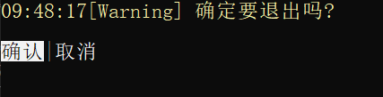
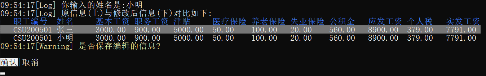
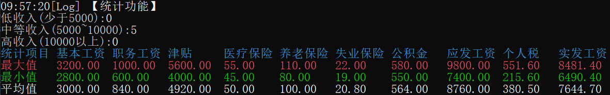
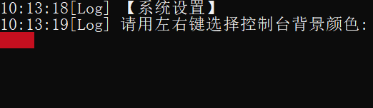
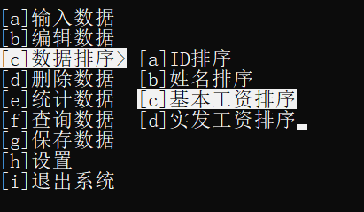
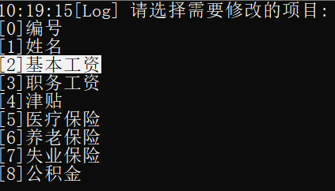

# 课设:工资管理系统
## 使用说明
### 使用说明的使用说明
   - 如果不是在Github上看到这个项目,强烈建议访问我的[Github上的Repo](https://github.com/LovelyCatHyt/CProjects/tree/master/PayrollSystem)
   - 原文档为.md格式(*markdown*),如果没有md阅读器,则打开.docx版本,但可能不支持部分链接
   - 若使用支持**GFM**的md阅读器,部分链接可以直接跳转到对应的内容.通常情况的md阅读器也能支持大部分链接.
   - 部分链接直接引用了代码中的**具体行数**,但由于编写本文档时代码可能发生变动,因此定位可能会有一定偏差.
### 总述
   - 功能之间的串联由[菜单系统](#menumgr)实现.  
   - 部分询问提供"__确定__""__取消__"两个选项,也可以用<kbd>←</kbd><kbd>→</kbd>选择,<kbd>Enter</kbd>确定
     - 样例:
   - 程序第一次运行时会在运行路径处自动创建Setttings.json,Data.json.可以直接修改json中的内容来修改数据,也可以较方便地转化成其他形式的数据.
### 输入功能 `InputData()`
   - 根据程序给出的提示输入相应数据,每项数据输入后按下<kbd>Enter</kbd>提交
   - 不允许出现**重复**的编号
   - 可以取消保存编辑的信息
   - 默认循环输入
### 编辑功能 `EditData()`
   - 用**数字索引**选择指定信息的指定项目进行编辑,输入**负数**则退出编辑功能
   - 不允许出现**重复**的员工编号,即使与原编号相同
   - 编辑后可以不保存到工资表
     - 显示编辑前后对照:
### 排序功能
   - 按**ID**排序 `SortByID()`
   - 按**姓名**排序 `SortByName()`
   - 按**基本工资**排序 `SortByBaseWage()`
   - 按**实发工资**排序 `SortByTakeHomePay()`
   - 排序后功能自动退出
### 删除数据 `RemoveData()`
   - 用**数字索引**确定要删除的一条数据
   - 可以取消删除
### 统计功能 `DoStatistic()`
   - 统计不同实发工资区间的人数:**低收入**(0~5000) **中等收入**(5000~10000) 高收入(10000+)
   - 统计各项的**最大值**、**最小值**和**平均值**
     - 显示样例:
   - 显示后功能自动退出
### 查询数据 `SearchData()`
   - 按**ID**查询
   - 按**姓名**查询
   - 按**实发工资**查询
     - 输入下限、上限后显示对应列表
### 设置 `Settings()`
   - 设置控制台默认颜色
   - 设置工资表表头文字颜色
   - 设置工资表内容背景色
   - 设置是否自动保存
   - 进入设置界面后会显示一个色块,用<kbd>←</kbd><kbd>→</kbd>进行选择,用<kbd>Enter</kbd>确认.
     - 设置示例:
### 保存数据 `SaveData_UI()`
   - 保存当前程序中的工资表
### 退出系统 `ExitSystem()`
   - 可以取消退出
## 系统组成
### [Main](main.c)
这一部分仅由main.c构成  
结构体数组`FArray payrollList`定义于此  
~~因为数据是全局的不想破坏封装所以这个里面有400+行~~  
处于**最顶层**,负责依靠底层的实现来组织整个系统.
### Data
支持这个工资管理系统的**结构体**的操作  
原本数据编辑、查询功能应该在这个位置，但是这样将不得不扩展payrollList的作用域,所以最终只保留了Payroll结构体的一些基本操作.
### Toolkit
独立于工资管理系统的**工具库**.  
基本原则是高聚合、低耦合.  
该库理论上可以独立地移植到其他类似的管理系统中使用.  
包括以下模块:
1. [FlexibleArray.c - 变长数组](Toolkit/FlexibleArray.c)
   - 顾名思义 长度可以变化的数组
   - 支持**任意**数据类型,只需在初始化时填入相应类型大小(如`sizeof(int)`)
   - 提供`Add()` `RemoveAt()` `Search()` `SerachByCondition()` 等函数,使变长数组更容易使用
   - 但是使用时一定要注意Init和Free 否则会报0xC000 0005错误,因为访问了非法内存地址
   - 读取数组中的值时要进行较复杂的**类型转换**,如`((char *)a->array)[i]`.所以若需要在一个函数中多次使用,建议定义一个普通的指针简化调用语句
2. [ColorfulConsoler.c - 多彩的控制台](Toolkit/ColorfulConsoler.c)  
   ~~其实末尾应该是Console 但是都写这么多了就不改了😁~~  
   基于Windows.h实现了一系列的上色和与光标有关的功能,可以修改指定区域的文本前景背景色  
   参考的资料包括但不限于以下页面(全英):  
   [Windows Console documentation - Windows.h文档首页](https://docs.microsoft.com/en-us/windows/console)  
   [Console Screen Buffers - 控制台屏幕缓冲](https://docs.microsoft.com/en-us/windows/console/console-screen-buffers)  
   [SetConsoleTextAttribute function - 设置控制台文本属性](https://docs.microsoft.com/en-us/windows/console/setconsoletextattribute)  
   [FillConsoleOutputAttribute function - 填充控制台输出属性](https://docs.microsoft.com/en-us/windows/console/fillconsoleoutputattribute)  
3. [MenuMgr.c - 菜单管理器](Toolkit/MenuMgr.c)
   - 菜单管理器:能够展示一个菜单,该菜单可以用**方向键**控制.
   - 该菜单允许通过<kbd>↑</kbd><kbd>↓</kbd>选择**同一级**菜单的不同项,允许通过<kbd>←</kbd><kbd>→</kbd>选择**上一级**/**下一级**菜单,用<kbd>Enter</kbd>执行菜单内容
   - 允许按下菜单项前对应的字母定位到对应菜单项(仅限同一级菜单)
   - **高亮**显示选中的菜单
   - 菜单样例:
   - 还有一个简化版:[`ShowSimpleMenu()`](Toolkit/MenuMgr.c)仅返回一个int类的数据,且没有子菜单.但是可以用数字定位到对应项目.
     - 简化菜单样例:
4. [MsgBox.c - 消息弹窗](Toolkit/MsgBox.c)~~但其实没有弹窗~~
   - 显示一个"弹窗",用<kbd>←</kbd><kbd>→</kbd>选择"确认"或"取消",用<kbd>Enter</kbd>确定.
   - 当前选项会被**高亮**
5. [KeyCtrl.c - 键盘控制](Toolkit/KeyCtrl.c)
   - 提供一个函数[GetKeyInput()](Toolkit/KeyCtrl.c#L5),返回敲下的按键的**键码**
   - 但是由于某些键的特殊性,因此**自定义**了几个键码,在头文件保存为[enum KeyCode](Toolkit/KeyCtrl.h#L4)
6. [BetterIO.c - 更好的输入输出](Toolkit/BetterIO.c)
   - 该模块试图实现两个功能: **Delay()** 延时和**ClearUselessInput()** 清除无用输入
   - 但是**并没有达到最初编写这个模块的期望目标**:Delay的过程中用户输入会被下一次调用的scanf/getch等函数接收而产生不可预料的后果,ClearUserInput会导致程序暂停等待输入,而原计划是不产生停顿.
7. [Coordinate.c - 坐标](TOolkit/Coordinate.c)
   - 提供一系列有关COORD的函数
8. [Debugger.c - 调错器](Toolkit/Debugger.c)
   - ~~其实现在更像一个Logger~~
   - 用于打印带颜色和时间的Log Warning Error
   - 本来想实现可变参数列表,但是那样的话无法将参数全部传入printf.(除非实现一个语法分析,直接传递格式化的结果也是能实现~~但我不想做~~)